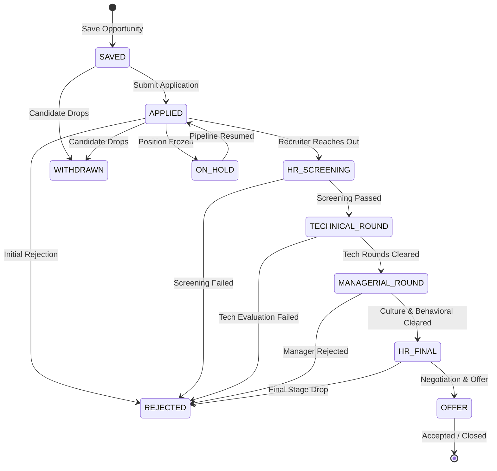
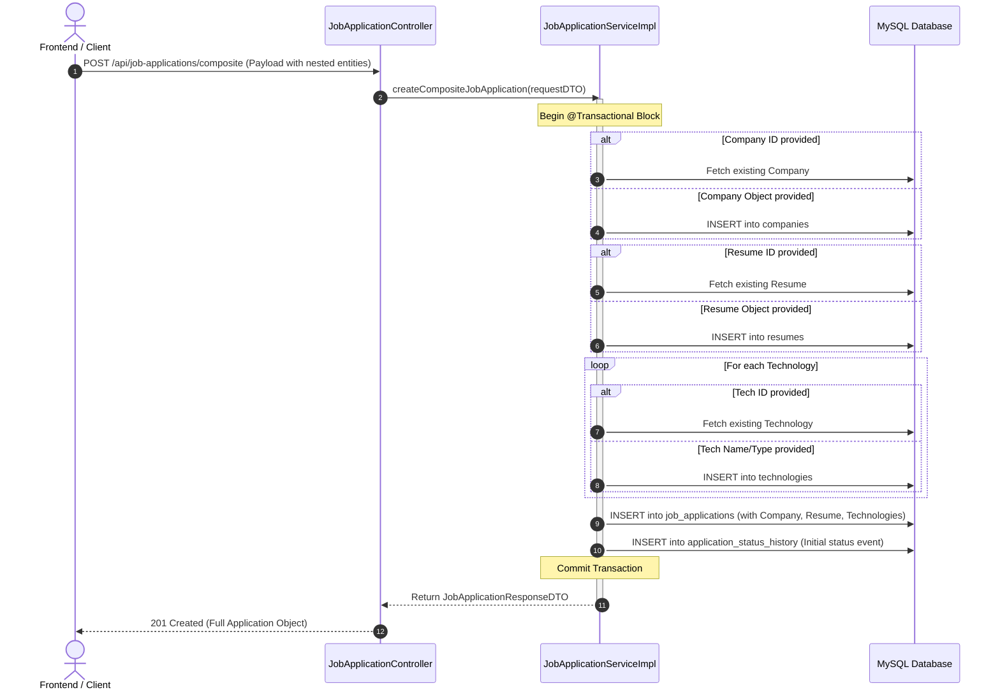
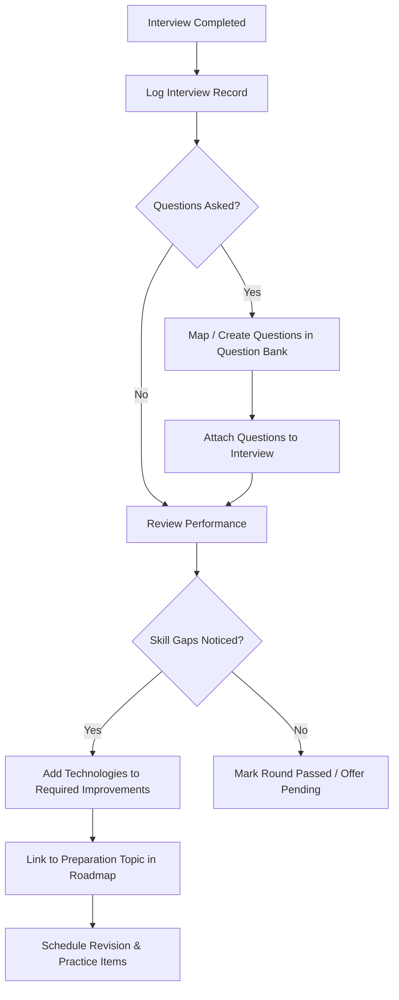
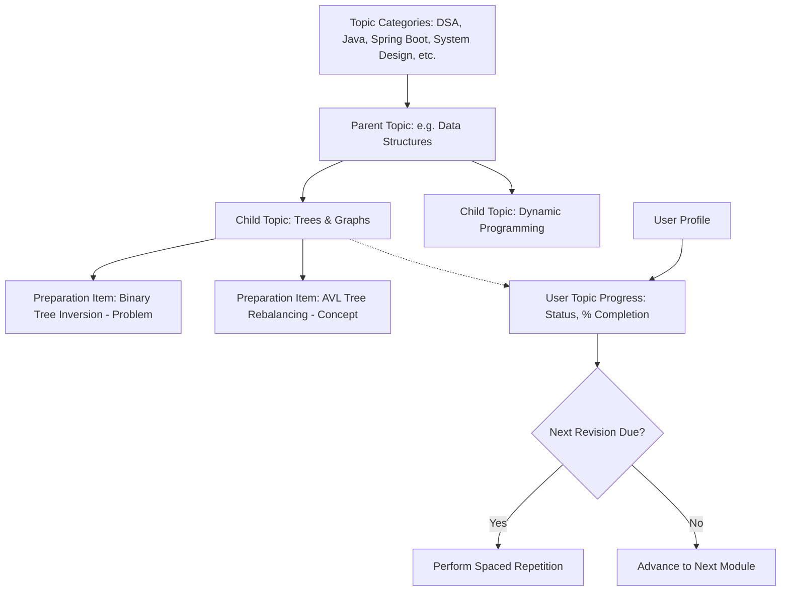
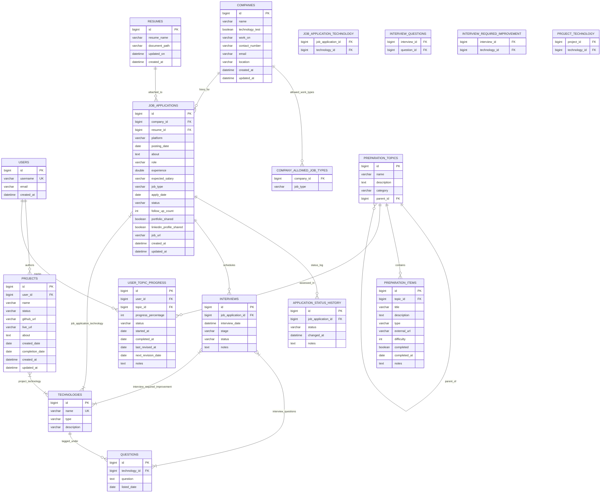

# 🎯 Interview Command Center — Backend REST API

[](https://www.oracle.com/java/)
[](https://spring.io/projects/spring-boot)
[](https://www.mysql.com/)
[](https://hibernate.org/)
[](https://swagger.io/)
[](https://mapstruct.org/)
[](https://projectlombok.org/)

A robust, enterprise-grade Spring Boot RESTful API designed to power the **Interview Command Center & Dashboard**. It acts as a single pane of glass for candidates navigating the modern tech hiring lifecycle — consolidating job hunting, multi-stage application status auditing, live interview debriefs, question banking, skill gap analysis, hierarchical learning roadmaps, and personal portfolio tracking.

---

## 📑 Table of Contents

1. [System Architecture & Design Patterns](#-system-architecture--design-patterns)
2. [High-Level Project Workflows](#-high-level-project-workflows)
   - [1. Job Application Lifecycle Flow](#1-job-application-lifecycle-flow)
   - [2. Composite Application Ingestion Flow](#2-composite-application-ingestion-flow)
   - [3. Interview Debrief & Skill Gap Loop](#3-interview-debrief--skill-gap-loop)
   - [4. Hierarchical Learning & Spaced Revision Flow](#4-hierarchical-learning--spaced-revision-flow)
3. [Entity-Relationship (ER) Diagram](#-entity-relationship-er-diagram)
4. [Data Model Dictionary](#-data-model-dictionary)
5. [REST API Catalog](#-rest-api-catalog)
6. [Tech Stack & Dependencies](#-tech-stack--dependencies)
7. [Prerequisites](#-prerequisites)
8. [Step-by-Step Setup Guide](#-step-by-step-setup-guide)
   - [Database Configuration](#1-database-configuration)
   - [Environment & Configuration Setup](#2-environment--configuration-setup)
   - [Build & Compilation](#3-build--compilation)
   - [Running the Application](#4-running-the-application)
9. [Verifying the Setup](#-verifying-the-setup)
10. [Directory Structure](#-directory-structure)

---

## 🏗 System Architecture & Design Patterns

The project is structured according to clean, layered architectural principles:

```
                  ┌───────────────────────────────┐
                  │    Client (Web UI / cURL)     │
                  └───────────────┬───────────────┘
                                  │ HTTP / JSON
                                  ▼
   ┌─────────────────────────────────────────────────────────────┐
   │                    REST Controller Layer                    │
   │  - OpenAPI 3 annotations    - ParameterObject pagination     │
   │  - Uniform HTTP responses   - DTO validation                │
   └───────────────┬─────────────────────────────┬───────────────┘
                   │                             │
                   ▼                             ▼
   ┌──────────────────────────────┐   ┌──────────────────────────┐
   │        Service Layer         │   │ GlobalExceptionHandler   │
   │ - Business transaction logic │   │ - Centralized @Advice    │
   │ - Cascade delete management  │   │ - Standard ErrorResponse │
   │ - @Transactional boundaries  │   └──────────────────────────┘
   └───────┬──────────────┬───────┘
           │              │
           ▼              ▼
   ┌──────────────┐ ┌───────────────────────────────────────────┐
   │  MapStruct   │ │             Repository Layer              │
   │ - DTO/Entity │ │ - Spring Data JPA (Crud & Paging)         │
   │   mapping    │ │ - JPA Specification Executor (Criteria API│
   └──────────────┘ └─────────────────────┬─────────────────────┘
                                          │
                                          ▼
                               ┌─────────────────────┐
                               │     MySQL 8.0+      │
                               └─────────────────────┘
```

### Key Architectural Patterns
* **Controller-Service-Repository Pattern**: Clean separation of concerns between HTTP presentation, core business logic, and database persistence.
* **JPA Specification & Criteria API**: Dynamic, type-safe filtering for pagination and multi-attribute search queries without raw SQL.
* **Composite Ingestion Pattern**: Single-transaction payload ingestion (`/api/job-applications/composite`) creating or linking Companies, Resumes, and Technologies on the fly while generating initial audit records.
* **Compile-Time Mapping with MapStruct**: High-performance, reflection-free object mapping between entities and Request/Response DTOs.
* **Double-Checked Locking Singleton**: Thread-safe `CustomLogger` utility demonstrating high-performance custom logging.
* **Centralized Exception Handling**: Uniform error JSON payloads using `@RestControllerAdvice` handling custom `ResourceNotFoundException`, `InvalidDataException`, and Spring validation exceptions.

---

## 🔄 High-Level Project Workflows

### 1. Job Application Lifecycle Flow

Job applications progress through distinct stages tracked in real time. Each transition is logged in `ApplicationStatusHistory` to maintain a historical audit trail.



---

### 2. Composite Application Ingestion Flow

The composite endpoint allows clients to save a complete application in a single HTTP request, creating missing sub-entities and linking existing ones seamlessly.



---

### 3. Interview Debrief & Skill Gap Loop

After completing an interview, candidates capture questions asked and identify technical topics requiring remediation.



---

### 4. Hierarchical Learning & Spaced Revision Flow

Preparation is modeled hierarchically (Categories $\rightarrow$ Parent Topics $\rightarrow$ Subtopics $\rightarrow$ Actionable Items) and tracked per user.



---

## 📊 Entity-Relationship (ER) Diagram

Below is the complete entity-relationship model implemented in Hibernate and MySQL:



---

## 📖 Data Model Dictionary

| Entity | Primary Table | Purpose & Key Associations |
| :--- | :--- | :--- |
| **`User`** | `users` | Platform user profile. Associated with `projects` (1:M) and `user_topic_progress` (1:M). |
| **`Company`** | `companies` | Target employers. Contains metadata, contact details, work domain, and job types allowed (via `@ElementCollection`). |
| **`Resume`** | `resumes` | Candidate resumes and versions used when applying for roles. |
| **`Technology`** | `technologies` | Central tech taxonomy (Java, React, Docker, etc.) tagged across applications, projects, interviews, and questions. |
| **`JobApplication`** | `job_applications` | Core application record linking Company, Resume, Technologies, Interviews, and Status Histories. |
| **`ApplicationStatusHistory`** | `application_status_history` | Audit log tracking chronological status changes for each application. |
| **`Interview`** | `interviews` | Specific interview rounds (HR, Technical, Managerial, etc.) with questions asked and improvement areas. |
| **`Question`** | `questions` | Technical and behavioral questions cataloged by technology and listed dates. |
| **`Project`** | `projects` | Portfolio projects authored by a user, mapped to the underlying tech stack and URLs. |
| **`PreparationTopic`** | `preparation_topics` | Self-referencing hierarchical syllabus nodes categorized by DSA, System Design, Spring, etc. |
| **`PreparationItem`** | `preparation_items` | Granular learning tasks (problems, articles, videos) within a topic, tracking completion status. |
| **`UserTopicProgress`** | `user_topic_progress` | User-specific tracking of learning mastery %, completion dates, and spaced repetition intervals. |

### Enumerations Reference
* **`ApplicationStatus`**: `SAVED`, `APPLIED`, `HR_SCREENING`, `TECHNICAL_ROUND`, `MANAGERIAL_ROUND`, `HR_FINAL`, `OFFER`, `REJECTED`, `ON_HOLD`, `WITHDRAWN`
* **`InterviewStage`**: `HR`, `TECHNICAL`, `MANAGERIAL`, `HR_FINAL`
* **`InterviewStatus`**: `SCHEDULED`, `COMPLETED`, `PASSED`, `FAILED`, `CANCELLED`, `RESCHEDULED`
* **`ItemType`**: `CONCEPT`, `PROBLEM`, `QUESTION`, `ARTICLE`, `VIDEO`, `ASSIGNMENT`
* **`JobType`**: `REMOTE`, `ON_SITE`, `HYBRID`
* **`PreparationStatus`**: `NOT_STARTED`, `LEARNING`, `PRACTICING`, `COMPLETED`, `NEEDS_REVISION`
* **`ProjectStatus`**: `PLANNED`, `IN_PROGRESS`, `COMPLETED`, `ON_HOLD`, `ARCHIVED`
* **`TechnologyType`**: `LANGUAGE`, `FRAMEWORK`, `DATABASE`, `CLOUD`, `TOOL`, `CONCEPT`, `LIBRARY`, `PROTOCOL`
* **`TopicCategory`**: `DSA`, `JAVA`, `SPRING_BOOT`, `SPRING_SECURITY`, `REACT`, `SQL`, `SYSTEM_DESIGN`, `AWS`, `DEVOPS`, `OTHER`

---

## 🔌 REST API Catalog

All endpoints support pagination (`?page=0&size=10&sort=id,desc`) and dynamic filtering via query parameters.

### 1. Job Applications (`/api/job-applications`)
* `POST /api/job-applications` — Create job application referencing existing entity IDs.
* `POST /api/job-applications/composite` — **Atomic composite endpoint** to create/link Company, Resume, Technologies, and initial Status History in one call.
* `GET /api/job-applications` — Paginated list with dynamic filtering (`platform`, `role`, `status`, `jobType`, `companyId`, `applyDateStart`, `applyDateEnd`).
* `GET /api/job-applications/{id}` — Retrieve detailed application by ID.
* `PUT /api/job-applications/{id}` — Update application details and relationships.
* `DELETE /api/job-applications/{id}` — Cascade delete application and its associated status history records.

### 2. Interviews (`/api/interviews`)
* `POST /api/interviews` — Schedule a new interview round linked to a job application.
* `GET /api/interviews` — Paginated list with filtering (`stage`, `status`, `jobApplicationId`, date range).
* `GET /api/interviews/{id}` — Retrieve interview details with questions and improvement areas.
* `PUT /api/interviews/{id}` — Update interview outcome, notes, and question associations.
* `DELETE /api/interviews/{id}` — Delete interview record.

### 3. Companies (`/api/companies`)
* `POST /api/companies` — Register a company.
* `GET /api/companies` — Paginated list with filtering (`name`, `location`, `workOn`).
* `GET /api/companies/{id}` — Retrieve company profile.
* `PUT /api/companies/{id}` — Update company profile.
* `DELETE /api/companies/{id}` — Delete company record.

### 4. Preparation Topics & Items
* **Topics (`/api/preparation-topics`)**:
  * `POST /api/preparation-topics` — Create topic or subtopic (with `parentId`).
  * `GET /api/preparation-topics` — Paginated list with filtering (`category`, `name`, `parentId`).
  * `GET /api/preparation-topics/{id}` — Retrieve topic and its child nodes.
  * `PUT /api/preparation-topics/{id}` — Update topic (prevents cyclic parenting).
  * `DELETE /api/preparation-topics/{id}` — Safe delete (prevents deleting nodes with children).
* **Items (`/api/preparation-items`)**:
  * `POST /api/preparation-items` — Add actionable item (problem/article/video) under a topic.
  * `GET /api/preparation-items` — Paginated list with filtering (`topicId`, `type`, `completed`, `difficulty`).
  * `GET /api/preparation-items/{id}` — Retrieve item details.
  * `PUT /api/preparation-items/{id}` — Update progress and notes.
  * `DELETE /api/preparation-items/{id}` — Remove item.

### 5. Learning Progress Tracking (`/api/user-topic-progress`)
* `POST /api/user-topic-progress` — Initialize user progress for a topic (enforces unique user-topic pairs).
* `GET /api/user-topic-progress` — Filter by `userId`, `topicId`, `status`.
* `GET /api/user-topic-progress/{id}` — Fetch specific progress record.
* `PUT /api/user-topic-progress/{id}` — Update percentage, status, and revision intervals.
* `DELETE /api/user-topic-progress/{id}` — Delete progress entry.

### 6. Supporting Modules
* **Users (`/api/users`)**: User registration and management.
* **Projects (`/api/projects`)**: Personal portfolio project tracker.
* **Technologies (`/api/technologies`)**: Global skill and technology registry.
* **Questions (`/api/questions`)**: Interview question bank.
* **Resumes (`/api/resumes`)**: Resume document registry.
* **Application Status Histories (`/api/application-status-histories`)**: Historical status logs.

---

## 💻 Tech Stack & Dependencies

| Component | Technology | Version / Specification |
| :--- | :--- | :--- |
| **Language** | Java (JDK) | 21 (Tested on Java 21 & 23) |
| **Framework** | Spring Boot | 4.1.x / 3.x with Spring MVC & Data JPA |
| **Database** | MySQL | 8.0+ (`mysql-connector-j`) |
| **ORM / Persistence** | Hibernate 6+ / Jakarta Persistence | Automated DDL Schema (`update`) |
| **DTO Mapping** | MapStruct | 1.6.3 |
| **Boilerplate Reduction**| Project Lombok | 1.18.30 (with MapStruct binding) |
| **API Documentation** | SpringDoc OpenAPI | 2.6.0 (Swagger UI v3) |
| **Build Tool** | Apache Maven | 3.9+ (includes `mvnw` wrapper) |

---

## ⚙️ Prerequisites

Ensure your development environment has the following installed:

1. **Java Development Kit (JDK 21 or higher)**
   Verify installation:
   ```bash
   java -version
   ```
2. **MySQL Server (v8.0 or higher)**
   Verify that the MySQL service is running locally on port `3306`.
3. **Maven 3.9+** (Optional: You can use the pre-packaged `./mvnw` or `mvnw.cmd`).
4. **Git** for version control.

---

## 🚀 Step-by-Step Setup Guide

### 1. Database Configuration

1. Log into your MySQL console or a GUI client (e.g., MySQL Workbench, DBeaver):
   ```bash
   mysql -u root -p
   ```
2. Create the project database:
   ```sql
   CREATE DATABASE IF NOT EXISTS interview_dashboard_db 
   CHARACTER SET utf8mb4 
   COLLATE utf8mb4_unicode_ci;
   ```
3. (Optional) Verify user permissions:
   ```sql
   GRANT ALL PRIVILEGES ON interview_dashboard_db.* TO 'root'@'localhost';
   FLUSH PRIVILEGES;
   ```

---

### 2. Environment & Configuration Setup

Review and configure `src/main/resources/application.yaml`:

```yaml
spring:
  application:
    name: interview-dashboard

  datasource:
    url: jdbc:mysql://localhost:3306/interview_dashboard_db?useSSL=false&serverTimezone=UTC&allowPublicKeyRetrieval=true
    username: root
    password: root # <-- Update this with your local MySQL password
    driver-class-name: com.mysql.cj.jdbc.Driver

  jpa:
    hibernate:
      ddl-auto: update # Automatically creates and updates tables
    show-sql: true
    properties:
      hibernate:
        format_sql: true
        dialect: org.hibernate.dialect.MySQLDialect
    open-in-view: false
```

> [!TIP]
> If your MySQL `root` password is not `root`, update the `password` field in `application.yaml` or set it via system environment variables.

---

### 3. Build & Compilation

The project uses Lombok alongside MapStruct. The compiler plugin is pre-configured with the `lombok-mapstruct-binding` processor.

* **On Windows (PowerShell / Command Prompt)**:
  ```powershell
  .\mvnw.cmd clean compile
  ```
* **On Linux / macOS (Bash)**:
  ```bash
  chmod +x mvnw
  ./mvnw clean compile
  ```

To build a self-contained production executable JAR:
```powershell
.\mvnw.cmd clean package -DskipTests
```

---

### 4. Running the Application

#### Option A: Running via Maven Wrapper (Recommended for Development)
* **Windows**:
  ```powershell
  .\mvnw.cmd spring-boot:run
  ```
* **Linux / macOS**:
  ```bash
  ./mvnw spring-boot:run
  ```

#### Option B: Running the Packaged JAR
```bash
java -jar target/interview-dashboard-0.0.1-SNAPSHOT.jar
```

The server will start on port **`8080`** by default.

---

## 🔍 Verifying the Setup

### 1. Interactive Swagger UI
Once running, open your web browser and navigate to:
👉 **[http://localhost:8080/swagger-ui/index.html](http://localhost:8080/swagger-ui/index.html)**

You can view interactive OpenAPI schema definitions and execute API calls directly from the browser.

* OpenAPI Specification JSON: `http://localhost:8080/v3/api-docs`

---

### 2. Quick Smoke Test via cURL

#### Step 1: Create a User
```bash
curl -X POST "http://localhost:8080/api/users" \
     -H "Content-Type: application/json" \
     -d '{
       "username": "johndoe",
       "email": "johndoe@example.com"
     }'
```

#### Step 2: Ingest a Composite Job Application
```bash
curl -X POST "http://localhost:8080/api/job-applications/composite" \
     -H "Content-Type: application/json" \
     -d '{
       "platform": "LinkedIn",
       "postingDate": "2026-09-15",
       "about": "Senior Backend Engineer role working with Spring Boot and Distributed Systems.",
       "role": "Senior Java Engineer",
       "experience": 4.5,
       "expectedSalary": "120,000 USD",
       "jobType": "REMOTE",
       "applyDate": "2026-09-18",
       "status": "APPLIED",
       "portfolioShared": true,
       "linkedInProfileShared": true,
       "jobUrl": "https://linkedin.com/jobs/view/123456789",
       "company": {
         "name": "Acme Innovations",
         "technologyTest": true,
         "workOn": "Cloud Native FinTech",
         "allowedJobType": ["REMOTE", "HYBRID"],
         "contactNumber": "+1-555-0199",
         "email": "careers@acme.io",
         "location": "San Francisco, CA"
       },
       "resume": {
         "resumeName": "Backend_Focus_2026.pdf",
         "documentPath": "/storage/resumes/backend_2026.pdf"
       },
       "technologys": [
         { "name": "Java 21", "type": "LANGUAGE" },
         { "name": "Spring Boot", "type": "FRAMEWORK" },
         { "name": "MySQL", "type": "DATABASE" }
       ]
     }'
```

#### Step 3: Fetch Filtered Applications
```bash
curl -X GET "http://localhost:8080/api/job-applications?role=Java&status=APPLIED&page=0&size=10"
```

---

## 📂 Directory Structure

```
interview-dashboard-backend/
├── pom.xml                                  # Maven dependencies & build plugins
├── mvnw / mvnw.cmd                          # Maven wrapper executables
└── src/
    ├── main/
    │   ├── java/com/me/interview/dashboard/
    │   │   ├── InterviewDashboardApplication.java # Spring Boot entry point
    │   │   ├── controller/                  # REST Controllers (@RequestMapping)
    │   │   │   ├── ApplicationStatusHistoryController.java
    │   │   │   ├── CompanyController.java
    │   │   │   ├── InterviewController.java
    │   │   │   ├── JobApplicationController.java
    │   │   │   ├── PreparationItemController.java
    │   │   │   ├── PreparationTopicController.java
    │   │   │   ├── ProjectController.java
    │   │   │   ├── QuestionController.java
    │   │   │   ├── ResumeController.java
    │   │   │   ├── TechnologyController.java
    │   │   │   ├── UserController.java
    │   │   │   └── UserTopicProgressController.java
    │   │   ├── dto/                         # Request, Response, Nested, & Filter DTOs
    │   │   ├── enumeration/                 # Domain Enums (Status, Stage, Categories)
    │   │   ├── exception/                   # GlobalExceptionHandler & Custom Exceptions
    │   │   ├── mapper/                      # MapStruct interfaces
    │   │   ├── model/                       # JPA Entities (@Entity, @Table)
    │   │   ├── repository/                  # Spring Data JPA Repositories
    │   │   ├── service/                     # Service Interfaces
    │   │   │   └── impl/                    # Service Implementations (@Service)
    │   │   ├── specification/               # Spring Data JPA Criteria Specifications
    │   │   └── util/                        # CustomLogger Singleton
    │   └── resources/
    │       └── application.yaml             # Datasource, Hibernate, & Spring config
    └── test/
        └── java/com/me/interview/dashboard/
            └── InterviewDashboardApplicationTests.java
```

---

## 🛡 License

This project is intended for personal and professional interview tracking and preparation management.
